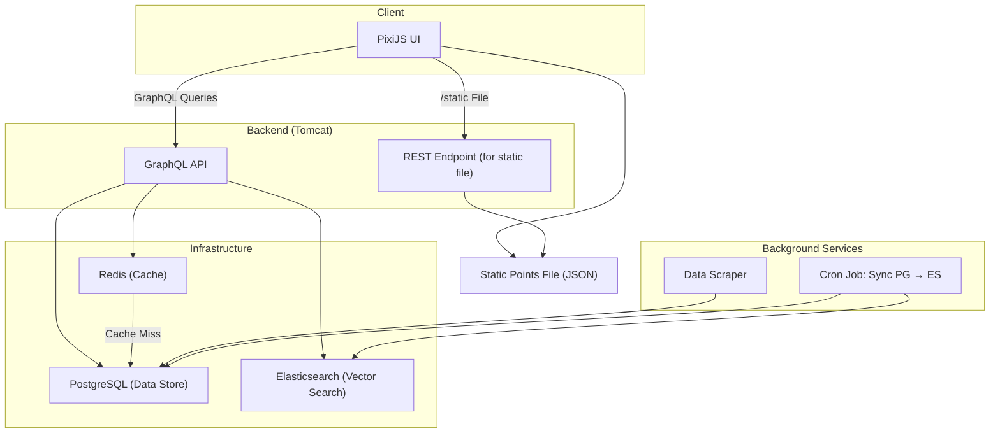

# AnimeVisualizer

Goals:
- Scrape the website for all info about top 1000 anime or manga (or both)
  - use beautifulsoup as api rate limit is too small
  - find an effective way to get comments
  - must needed fields: name, author/studio, genres, audience, score, etc.
- generate embeddings of different kinds from these
  - text based, plot based, score based, things similar people have seen.
- visualize those in a website

New Goals (6/3/25)
- use MAL and rewrite the scraper to not use beautifulsoup and instead use the actual API
- Add user preference embedding (average of all the user's liked anime) - use small embeddings for this so it's less intensive on server
- store data in postgres + create embeddings for elastic
- find someone to make the ui nice
- add search and recommendation system (content filtering) - lots of vector search and hybrid/blended search
- vector search for search bar
- some form of top k feature where the user picks a few anime and we use the average embedding of those anime (use small embeddings)
- find a good balanced embedding dimension that allows good search but is also light on the cpu
- graph layer + graph api to fetch data about an anime (figure out if its worth storing most anime data or querying from mal when needed)
- caching layer - redis for recently searched anime, will be helpful because `SELECT` operation is costly
- cron job to sync elastic and sql (figure out how much data to keep in both data stores and how much can be normalized)
- figure out schema (use postgres or some performant sql db that can be sharded if necessary)

Side thoughts
- monetizing the site?
- ci/cd pipelines + instrumentation 

## System Architecture

