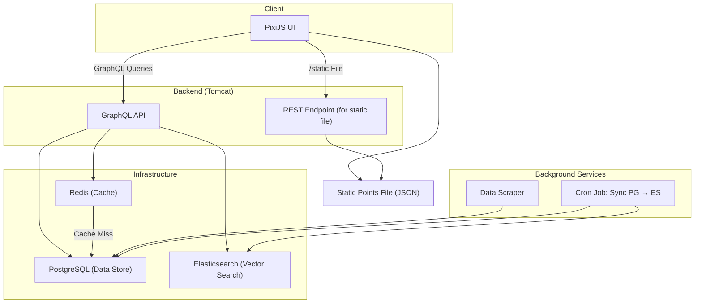

# AnimeVisualizer

Goals:
- Scrape the website for all info about top 1000 anime or manga (or both)
  - use beautifulsoup as api rate limit is too small
  - find an effective way to get comments
  - must needed fields: name, author/studio, genres, audience, score, etc.
- generate embeddings of different kinds from these
  - text based, plot based, score based, things similar people have seen.
- visualize those in a website

New Goals (6/3/25)
- use MAL and rewrite the scraper to not use beautifulsoup and instead use the actual API
- Add user preference embedding (average of all the user's liked anime) - use small embeddings for this so it's less intensive on server
- store data in postgres + create embeddings for elastic
- find someone to make the ui nice
- add search and recommendation system (content filtering) - lots of vector search and hybrid/blended search
- vector search for search bar (natural language input such as "anime about revenge and demons" (e.g. demon slayer)
- some form of top k feature where the user picks a few anime and we use the average embedding of those anime (use small embeddings)
- find a good balanced embedding dimension that allows good search but is also light on the cpu
- graph layer + graph api to fetch data about an anime (figure out if its worth storing most anime data or querying from mal when needed)
- caching layer - redis for recently searched anime, will be helpful because `SELECT` operation is costly - bloom filter?
- cron job to sync elastic and sql (figure out how much data to keep in both data stores and how much can be normalized)
- figure out schema (use postgres or some performant sql db that can be sharded if necessary)
- surprise me/random button
- add a seasonal anime feature in the UI
- "near this anime" feature in UI
- visual map highlighting what the user has watched

Side thoughts
- ci/cd pipeline to track version/rollout
- instrumentation - some type of splunk logs would be nice
- down detection
- monetizing the site?
- recommendation system could have some boosting based on the ranks (ranks change over time so different results get boosted based on what's popular at the moment)

Implementation Plans
- initial data returned to ui should be very minimal, get more data for an individual anime later using graph calls
- may have to implement some form of pagination
- cron job to scrape + update elastic
- exploration vs exploitation - if popular items keep getting recommended → use exploration (maybe keep a count of how many times something has been recommended)
- mix in unusual or slightly random recommendations (exploration)
- penalize redundancy in recommendations (genre, studio, etc.)
```
4. ElasticSearch
Store:
Title, description embeddings (from SBERT or BERT)
Genre tokens, studios
Popularity, rating, date
Custom scoring function:
score = w1 * vector_sim + w2 * genre_match + w3 * popularity_decay
5. Search Autocomplete
GraphQL or REST search endpoint for:
Anime titles
Tags/genres
Studio or creator names
Use fuzzy search and prefix matching via Elasticsearch
6. Analytics Collection
Track:
Time spent on anime pages
Hover → clickthrough ratios in maps
Filter usage patterns
Store in PostgreSQL or send to a time-series DB for later improvements
```


Ideas we could implement later 
- anime discovery quiz (may require more understanding of what anime falls into what categor(ies))
- mood based filtering: happy, dark, slow-paced, intense, wholesome, tragic, etc. (hard to categorize anime into these labels)
- Filtering:
  - Genre, studio, rating, year, length, airing/completed
  - Moods: "wholesome", "tragic", "philosophical", "intense"
  - Popularity tiers: "Hidden gems", "Cult classics", "Underrated"

## System Architecture

