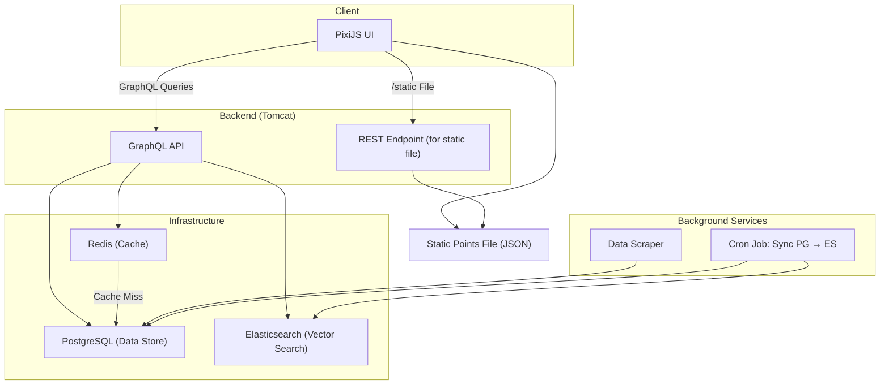

# AnimeVisualizer

Goals:
- Scrape the website for all info about top 1000 anime or manga (or both)
  - use beautifulsoup as api rate limit is too small
  - find an effective way to get comments
  - must needed fields: name, author/studio, genres, audience, score, etc.
- generate embeddings of different kinds from these
  - text based, plot based, score based, things similar people have seen.
- visualize those in a website

## System Architecture
